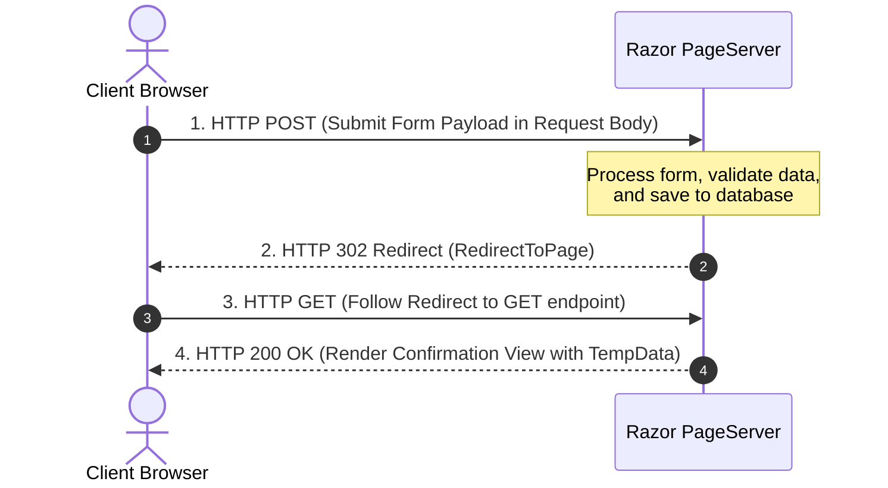

# HTTP Methods, Route Parameters, and Query Strings in Razor Pages

## Overview: The HTTP Demo Pages

Understanding how data travels between the browser and the server across HTTP requests is fundamental to web development. ASP.NET Core Razor Pages provides intuitive abstractions for working with HTTP requests, URL routes, query strings, and form submissions.

The **HttpDemo** interactive pages (`Pages/HttpDemo/`) demonstrate four essential web development patterns:

1. **HTTP GET & Query Strings** (`/HttpDemo/GetDemo`): How data is passed in the URL query string using `method="get"` and bound with `[BindProperty(SupportsGet = true)]`.
2. **Route Parameters vs Query Strings** (`/HttpDemo/RouteDemo`): The semantic difference between pinpointing a resource via URL routes (`/Staff/101`) versus modifying view state via query strings (`?tab=compensation`).
3. **Multiple Route Parameters** (`/HttpDemo/MultiRouteDemo`): Mapping multiple URL path segments using `@page "{department?}/{id:int?}"`.
4. **HTTP POST & Post-Redirect-Get (PRG)** (`/HttpDemo/PostDemo`): Submitting data safely inside the HTTP Request Body and preventing duplicate form submissions using the PRG pattern.

---

## 1. HTTP GET & Query Strings (`GetDemo`)

### Concept

An **HTTP GET** request retrieves data from a server without modifying server state. When a form uses `method="get"`, browser form control inputs are serialized directly into the URL **query string** as key-value pairs (e.g. `?Subject=Computer+Science&Level=Beginner`).

### Implementation (`Pages/HttpDemo/GetDemo.cshtml.cs`)

To bind properties from a GET query string in Razor Pages, decorate properties with `[BindProperty(SupportsGet = true)]`:

```csharp
namespace MyRazorApp.Pages.HttpDemo;

public class GetDemoModel : PageModel
{
    // Reads from URL query string parameter ?Subject=...
    [BindProperty(SupportsGet = true)]
    public string? Subject { get; set; }

    // Reads from URL query string parameter ?Level=...
    [BindProperty(SupportsGet = true)]
    public string? Level { get; set; }

    // Reads from URL query string parameter ?Keyword=...
    [BindProperty(SupportsGet = true)]
    public string? Keyword { get; set; }

    public List<Course> FilteredCourses { get; set; } = [];

    public void OnGet()
    {
        var query = AllCourses.AsEnumerable();

        if (!string.IsNullOrWhiteSpace(Subject))
        {
            query = query.Where(c => c.Category.Equals(Subject, StringComparison.OrdinalIgnoreCase));
        }

        if (!string.IsNullOrWhiteSpace(Level))
        {
            query = query.Where(c => c.Level.Equals(Level, StringComparison.OrdinalIgnoreCase));
        }

        if (!string.IsNullOrWhiteSpace(Keyword))
        {
            query = query.Where(c => c.Title.Contains(Keyword, StringComparison.OrdinalIgnoreCase) ||
                                     c.Code.Contains(Keyword, StringComparison.OrdinalIgnoreCase));
        }

        FilteredCourses = query.ToList();
    }
}
```

### View Implementation (`Pages/HttpDemo/GetDemo.cshtml`)

```cshtml
<!-- Filter Form sending data via HTTP GET -->
<form method="get" class="search-form">
    <select asp-for="Subject">
        <option value="">-- All Categories --</option>
        <option value="Computer Science">Computer Science</option>
        <option value="Data Science">Data Science</option>
    </select>

    <select asp-for="Level">
        <option value="">-- All Levels --</option>
        <option value="Beginner">Beginner</option>
        <option value="Advanced">Advanced</option>
    </select>

    <input type="text" asp-for="Keyword" placeholder="Search keyword..." />

    <button type="submit">Filter Courses (GET)</button>

    @if (Request.Query.Count > 0)
    {
        <a asp-page="/HttpDemo/GetDemo" class="btn btn-secondary">Reset Filters</a>
    }
</form>
```

> [!NOTE]
> **Why use HTTP GET for searches and filters?**
> - **Bookmarkable & Shareable**: Because all parameters are stored in the URL (`?Subject=Computer+Science&Level=Beginner`), users can bookmark or share the URL to return to the exact same filtered state.
> - **Idempotent**: Performing a GET request multiple times is safe and produces identical results without altering server data.

---

## 2. Route Parameters vs Query Strings (`RouteDemo`)

### Architectural Distinction

A common design question is when to put values into the **URL Path** versus the **Query String**:

| Concept | Syntax / URL Example | Purpose & Best Practice |
|---|---|---|
| **Route Parameter** | `/HttpDemo/RouteDemo/101` | **Locating a Resource**: Identifies a specific entity (e.g. Staff ID 101, Product ID 42, Article Slug). |
| **Query String** | `?tab=employment&viewMode=detailed` | **Modifying View Options**: Optional parameters such as active tab, view mode, sort order, or pagination page numbers. |

### Page Directive & Code-Behind (`Pages/HttpDemo/RouteDemo.cshtml.cs`)

```cshtml
@page "{id:int?}"
@model MyRazorApp.Pages.HttpDemo.RouteDemoModel
```

```csharp
namespace MyRazorApp.Pages.HttpDemo;

public class RouteDemoModel : PageModel
{
    // Bound from the URL route path: @page "{id:int?}" (e.g. /HttpDemo/RouteDemo/101)
    [BindProperty(SupportsGet = true)]
    public int? Id { get; set; }

    // Bound from the query string: ?tab=compensation
    [BindProperty(SupportsGet = true)]
    public string? Tab { get; set; } = "overview";

    public StaffMemberDemo? SelectedMember { get; set; }

    public void OnGet(int? id)
    {
        if (id.HasValue)
        {
            SelectedMember = StaffDatabase.FirstOrDefault(s => s.Id == id.Value);
        }
    }
}
```

### Tag Helper Generation (`Pages/HttpDemo/RouteDemo.cshtml`)

When generating links with Tag Helpers, Razor automatically routes matching directive parameters into the URL path and remaining parameters into the query string:

```cshtml
<!-- Generates URL path: /HttpDemo/RouteDemo/101?tab=overview -->
<a asp-page="/HttpDemo/RouteDemo"
   asp-route-id="@staff.Id"
   asp-route-tab="overview">
   Overview
</a>

<!-- Generates URL path: /HttpDemo/RouteDemo/101?tab=compensation -->
<a asp-page="/HttpDemo/RouteDemo"
   asp-route-id="@staff.Id"
   asp-route-tab="compensation">
   Compensation
</a>
```

---

## 3. Multiple Route Parameters (`MultiRouteDemo`)

### Routing Directive with Multiple Segments

Razor Pages allows chaining multiple route parameter segments in the `@page` directive. Optional parameters are marked with `?`, and constraints like `:int` enforce parameter data types.

```cshtml
@page "{department?}/{id:int?}"
@model MyRazorApp.Pages.HttpDemo.MultiRouteDemoModel
```

### Path Matching Examples

Given the directive `@page "{department?}/{id:int?}"`:

- `/HttpDemo/MultiRouteDemo` &rarr; `department = null`, `id = null`
- `/HttpDemo/MultiRouteDemo/engineering` &rarr; `department = "engineering"`, `id = null`
- `/HttpDemo/MultiRouteDemo/engineering/101` &rarr; `department = "engineering"`, `id = 101`
- `/HttpDemo/MultiRouteDemo/engineering/101?tab=compensation` &rarr; `department = "engineering"`, `id = 101`, `tab = "compensation"`

### Code-Behind Handling (`Pages/HttpDemo/MultiRouteDemo.cshtml.cs`)

```csharp
namespace MyRazorApp.Pages.HttpDemo;

public class MultiRouteDemoModel : PageModel
{
    // Segment 1 in @page "{department?}/{id:int?}"
    [BindProperty(SupportsGet = true)]
    public string? Department { get; set; }

    // Segment 2 in @page "{department?}/{id:int?}"
    [BindProperty(SupportsGet = true)]
    public int? Id { get; set; }

    // Query string parameter ?tab=...
    [BindProperty(SupportsGet = true)]
    public string? Tab { get; set; } = "overview";

    public void OnGet(string? department, int? id)
    {
        // Department and Id are populated automatically from URL path segments
    }
}
```

> [!TIP]
> **Tag Helper Spillover Rule**:
> When using `asp-route-{name}` attributes:
> - Any attribute name that matches a parameter in the `@page` directive is appended to the **URL path**.
> - Any attribute name that does NOT match a route parameter is automatically appended to the **Query String**.

---

## 4. HTTP POST & The Post-Redirect-Get (PRG) Pattern (`PostDemo`)

### Concept

HTTP **POST** requests are used to submit data to the server for processing or state mutation (creating, updating, or deleting records). Unlike GET requests, POST data is sent inside the **HTTP Request Body**, hiding form inputs from the browser URL address bar, browser history, and server logs.

```http
POST /HttpDemo/PostDemo HTTP/1.1
Host: localhost:5110
Content-Type: application/x-www-form-urlencoded

Input.StudentName=Alex+Taylor&Input.Email=alex%40university.ac.uk&Input.Category=Lab+Exercise
```

### The Post-Redirect-Get (PRG) Pattern

Submitting a POST form directly returning a view can lead to duplicate database entries if the user presses Refresh (F5) or uses back navigation. The **Post-Redirect-Get (PRG)** pattern prevents this:



### Implementation (`Pages/HttpDemo/PostDemo.cshtml.cs`)

```csharp
namespace MyRazorApp.Pages.HttpDemo;

public class PostDemoModel : PageModel
{
    [BindProperty] // Binds on HTTP POST by default
    public FeedbackInput Input { get; set; } = new();

    // TempData holds value across a single HTTP redirect
    [TempData]
    public string? FlashMessage { get; set; }

    [TempData]
    public string? SubmittedStudentName { get; set; }

    public void OnGet()
    {
        // Renders view or displays confirmation message from TempData
    }

    public IActionResult OnPost()
    {
        if (!ModelState.IsValid)
        {
            return Page(); // Return view with validation errors if invalid
        }

        // Store success confirmation data in TempData across redirect
        FlashMessage = "Form successfully submitted via HTTP POST!";
        SubmittedStudentName = Input.StudentName;

        // PRG: Redirect to GET endpoint to clear POST state
        return RedirectToPage("/HttpDemo/PostDemo");
    }
}
```

### View Implementation (`Pages/HttpDemo/PostDemo.cshtml`)

```cshtml
<!-- Flash message rendered after PRG redirect -->
@if (!string.IsNullOrEmpty(Model.FlashMessage))
{
    <div class="alert-success">
        <h4>@Model.FlashMessage</h4>
        <p>Submitted by: @Model.SubmittedStudentName</p>
    </div>
}

<form method="post">
    <label asp-for="Input.StudentName"></label>
    <input asp-for="Input.StudentName" />
    <span asp-validation-for="Input.StudentName" class="text-danger"></span>

    <label asp-for="Input.Email"></label>
    <input asp-for="Input.Email" type="email" />
    <span asp-validation-for="Input.Email" class="text-danger"></span>

    <button type="submit">Submit Feedback (POST)</button>
</form>
```

---

## 5. Summary Matrix & Comparison

| Feature | HTTP GET (`GetDemo`) | Route Parameters (`RouteDemo`) | HTTP POST (`PostDemo`) |
|---|---|---|---|
| **Data Payload Location** | Query String (`?key=val`) | URL Path Segment (`/101`) | HTTP Request Body |
| **Model Binding Attribute** | `[BindProperty(SupportsGet = true)]` | `[BindProperty(SupportsGet = true)]` | `[BindProperty]` |
| **Primary Use Case** | Search, filter, sorting, pagination | Resource identification (ID/slug) | Creating/updating/deleting data |
| **Idempotent / Safe** | Yes | Yes | No (requires PRG pattern) |
| **Bookmarkable URL** | Yes | Yes | No |
| **Sensitive Data** | Never use (visible in URL & logs) | Never use | Preferred (hidden from URL) |

---

## Summary Checklist

1. Use **HTTP GET** (`method="get"`) and `[BindProperty(SupportsGet = true)]` for search, filtering, and data querying.
2. Use **Route Parameters** (`@page "{id:int}"`) to locate specific database entities or resources.
3. Use **Query Strings** (`?tab=compensation`) to control presentation options like active tabs, filters, and page numbers.
4. Use **HTTP POST** (`method="post"`) for actions that modify data on the server.
5. Always implement the **Post-Redirect-Get (PRG)** pattern (`RedirectToPage()`) with `[TempData]` for POST requests to avoid duplicate form resubmissions.
