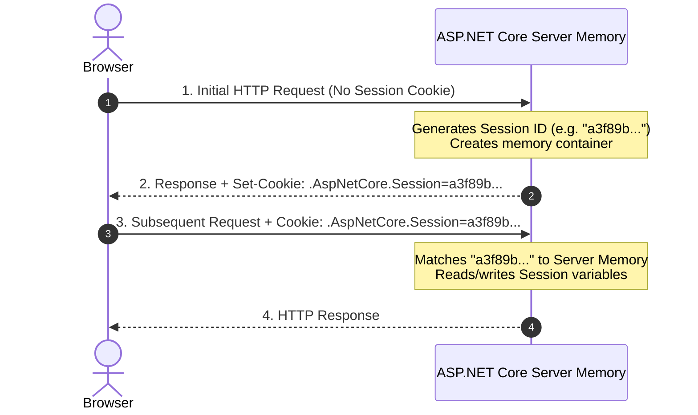

# State Management in Razor Pages: HTTP Cookies vs. ASP.NET Core Session

## Overview: Managing State in a Stateless Protocol

HTTP is a **stateless protocol**. By default, web servers process every HTTP request independently without remembering previous interactions. To build personalized web applications—such as saving user UI preferences, maintaining shopping carts, or preserving login sessions—developers use state management mechanisms.

The **StateDemo** interactive pages (`Pages/StateDemo/`) demonstrate the two primary ways to store per-user state in ASP.NET Core Razor Pages:

1. **HTTP Cookies** (`/StateDemo/CookieDemo`): **Client-side state** stored directly in the user's web browser.
2. **ASP.NET Core Session State** (`/StateDemo/SessionDemo`): **Server-side state** stored in web server memory, referenced via an encrypted Session ID cookie.

---

## 1. Client-Side State: HTTP Cookies (`CookieDemo`)

### Concept

An **HTTP Cookie** is a small piece of data sent from a web server and stored locally in the user's web browser. The browser automatically sends stored cookies back to the server in the `Cookie` header of every subsequent HTTP request to that domain.

```http
HTTP Response Header (Server -> Client):
Set-Cookie: UserTheme=dark; expires=Wed, 02 Sep 2026 12:00:00 GMT; path=/; httponly

HTTP Request Header (Client -> Server):
Cookie: UserTheme=dark; .AspNetCore.Antiforgery=...
```

### Writing a Cookie (`Response.Cookies.Append`)

Inside a `PageModel` handler method, write cookies using `Response.Cookies.Append(...)`:

```csharp
namespace MyRazorApp.Pages.StateDemo;

public class CookieDemoModel : PageModel
{
    [BindProperty]
    public string SelectedTheme { get; set; } = "light";

    [BindProperty]
    public bool IsPersistent { get; set; } = true;

    public IActionResult OnPostSetTheme()
    {
        var options = new CookieOptions
        {
            HttpOnly = false,  // Accessible via browser CSS / JS if needed
            IsEssential = true // GDPR / Cookie Consent compliance
        };

        if (IsPersistent)
        {
            // Persistent Cookie: Saved to disk with an expiration timestamp
            options.Expires = DateTimeOffset.UtcNow.AddDays(7);
        }
        // If IsPersistent is false, no Expiry date is set, creating a Session Cookie

        // Appends Set-Cookie header to HTTP Response
        Response.Cookies.Append("UserTheme", SelectedTheme, options);

        return RedirectToPage("/StateDemo/CookieDemo");
    }
}
```

### Reading & Deleting Cookies (`Request.Cookies`)

```csharp
public void OnGet()
{
    // Read cookie value from incoming HTTP Request header
    CurrentCookieTheme = Request.Cookies["UserTheme"] ?? "light";
}

public IActionResult OnPostDeleteCookie()
{
    // Deletes cookie by issuing a Set-Cookie response header with an expired timestamp
    Response.Cookies.Delete("UserTheme");

    return RedirectToPage("/StateDemo/CookieDemo");
}
```

### Types of Cookies: Session vs. Persistent Cookies

- **Session Cookie (Temporary)**: Created without setting an `Expires` or `MaxAge` property. Stored only in browser RAM memory and discarded automatically when the browser window is closed.
- **Persistent Cookie (Durable)**: Created with an explicit expiration date (`options.Expires = DateTimeOffset.UtcNow.AddDays(7)`). Saved to the user device's storage disk and survives browser restarts until the expiration timestamp passes.

> [!NOTE]
> **Cookie Options & Security**:
> - **`HttpOnly = true`**: Prevents client-side JavaScript (`document.cookie`) from reading the cookie, protecting against Cross-Site Scripting (XSS) attacks.
> - **`Secure = true`**: Ensures cookies are only transmitted over HTTPS encrypted connections.
> - **`SameSite`**: Restricts when cookies are sent across origin domains (`Strict`, `Lax`, or `None`), defending against Cross-Site Request Forgery (CSRF).

---

## 2. Server-Side State: ASP.NET Core Session (`SessionDemo`)

### Concept

**Session State** stores user data **on the web server** inside server memory (or a distributed cache like Redis).

Because the client browser should never hold sensitive application state directly, ASP.NET Core issues a single encrypted identifier cookie called `.AspNetCore.Session`. When requests arrive, the server reads the Session ID from the cookie, looks up the corresponding session in server memory, and retrieves the stored objects.



### Configuring Session Middleware (`Program.cs`)

To use ASP.NET Core Session state, register the required services and middleware in `Program.cs`:

```csharp
var builder = WebApplication.CreateBuilder(args);

// 1. Add in-memory caching and session services
builder.Services.AddDistributedMemoryCache();
builder.Services.AddSession(options =>
{
    options.IdleTimeout = TimeSpan.FromMinutes(30); // Session expires after 30 minutes of inactivity
    options.Cookie.HttpOnly = true;                 // Protect session ID from JS access
    options.Cookie.IsEssential = true;               // Required for site operation
});

var app = builder.Build();

// 2. Enable Session middleware (must be between UseRouting and UseAuthorization)
app.UseRouting();
app.UseSession();
app.UseAuthorization();
```

### Reading & Writing Session State (`Pages/StateDemo/SessionDemo.cshtml.cs`)

Razor Pages exposes session capabilities through `HttpContext.Session`:

```csharp
namespace MyRazorApp.Pages.StateDemo;

public class SessionDemoModel : PageModel
{
    public string CurrentSessionUser { get; set; } = "Guest";
    public int VisitCount { get; set; }
    public List<string> CartItems { get; set; } = [];

    public void OnGet()
    {
        // 1. Track and increment visit count integer in Session
        int visits = HttpContext.Session.GetInt32("VisitCount") ?? 0;
        visits++;
        HttpContext.Session.SetInt32("VisitCount", visits);
        VisitCount = visits;

        // 2. Retrieve user nickname string from Session
        CurrentSessionUser = HttpContext.Session.GetString("SessionUser") ?? "Guest";

        // 3. Retrieve shopping cart payload from Session
        string? cartRaw = HttpContext.Session.GetString("SessionCart");
        if (!string.IsNullOrWhiteSpace(cartRaw))
        {
            CartItems = cartRaw.Split('|', StringSplitOptions.RemoveEmptyEntries).ToList();
        }
    }

    public IActionResult OnPostSetUser(string userNickname)
    {
        // Store string in Session
        HttpContext.Session.SetString("SessionUser", userNickname.Trim());
        return RedirectToPage("/StateDemo/SessionDemo");
    }

    public IActionResult OnPostAddToCart(string newCartItem)
    {
        string? cartRaw = HttpContext.Session.GetString("SessionCart") ?? "";
        var items = cartRaw.Split('|', StringSplitOptions.RemoveEmptyEntries).ToList();
        items.Add(newCartItem.Trim());

        // Update Session keys
        HttpContext.Session.SetString("SessionCart", string.Join("|", items));
        HttpContext.Session.SetInt32("SessionCartCount", items.Count);

        return RedirectToPage("/StateDemo/SessionDemo");
    }

    public IActionResult OnPostClearSession()
    {
        // Clears all keys for the current user's session in server memory
        HttpContext.Session.Clear();
        return RedirectToPage("/StateDemo/SessionDemo");
    }
}
```

> [!TIP]
> **Storing Complex Objects in Session**:
> `HttpContext.Session` natively supports `SetString`, `SetInt32`, `GetString`, and `GetInt32`. To store complex C# objects (like shopping cart models or user profiles), serialize the objects to JSON using `System.Text.Json.JsonSerializer.Serialize(model)` before storing them with `SetString()`.

---

## 3. Comparison Matrix: Cookies vs. Session State

| Feature | HTTP Cookies | ASP.NET Core Session |
|---|---|---|
| **Storage Location** | Client Browser (disk or RAM) | Server Memory (or Redis cache) |
| **Client Identification** | Sent in `Cookie` request header | Identified via `.AspNetCore.Session` cookie |
| **Size Capacity Limit** | ~4 KB per cookie | Unlimited (constrained only by server memory) |
| **Data Security & Tampering** | User can view and alter cookies via browser dev tools | Highly Secure (client cannot view or edit server memory) |
| **Expiration Control** | Explicit Expiration date or Session end | Idle Timeout (e.g. 20–30 mins of inactivity) |
| **Primary Use Cases** | User UI themes, layout toggles, language preferences, "Remember Me" tokens | Shopping carts, multi-step wizards, temporary user login state |

---

## Summary Checklist

1. Use **HTTP Cookies** (`Response.Cookies.Append`) for non-sensitive client preferences like dark mode themes or UI settings that should persist across browser restarts.
2. Always set security attributes like `HttpOnly = true`, `Secure = true`, and `IsEssential = true` on production cookies.
3. Configure `AddSession()` and `UseSession()` in `Program.cs` when server-side state is required.
4. Use **ASP.NET Core Session** (`HttpContext.Session.SetString`) for temporary per-user data (such as shopping carts or wizard steps) that must remain secure from client tampering.
5. Use `HttpContext.Session.Clear()` when logging a user out or discarding transient session state.
